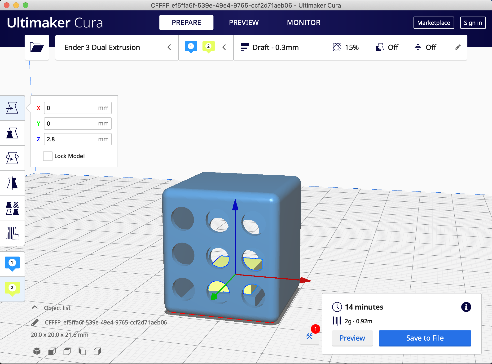

# Multicolor prints with a single extruder in Cura

Most techniques for printing multicolor prints on single extruder FDM printers are based on swapping filaments on layer changes, for example by enabling [Filament Change](https://github.com/Ultimaker/Cura/blob/master/plugins/PostProcessingPlugin/scripts/FilamentChange.py) or [Pause At Height](https://github.com/Ultimaker/Cura/blob/master/plugins/PostProcessingPlugin/scripts/PauseAtHeight.py) post-processing scripts in Cura. But wouldn't it be nice if filament changes could happen mid-layer? The following guide and scripts provided in this repository show how this can be done in [Cura](https://ultimaker.com/software/ultimaker-cura).

The idea is to emulate a printer with multiple extruders. However, whenever an extruder change happens, the printer is instructed to perform a filament change instead. 

## 1. Setting up a printer with multiple virtual extruders

The first step is to set up a _non-networked_, _custom FFF printer_ in Cura.

Next, machine settings need to be adjusted according to the printer specification. The easiest way is to simply copy these specifications from Curas default settings for the printer model and increase the *Number of Extruders* to 2 or greater, depending on how many different colors prints will have.

## 2. Post-processing configuration

When slicing Cura needs to modify the generated G-Code in post-processing to instruct the printer to perform a filament instead of an extruder change.

There are two options to achieve this:
1. The most convenient option is to install the post-processing scripts provided in this repository and enable one of them when slicing models
2. Cura has an option to manually insert a snippet of G-Code when an extruder changes

Both options, including advantages and disadvantages, are described in the following.

### Option 1: Installing post-processing scripts

This repository contains two Python scripts: [FilamentChangeOnToolChange.py](https://github.com/scholtzan/cura-multicolor-single-extruder/blob/main/FilamentChangeOnToolChange.py) and [PauseAtHeightOnToolChange.py](https://github.com/scholtzan/cura-multicolor-single-extruder/blob/main/PauseAtHeightOnToolChange.py)

To install these as post-processing scripts in Cura, first, download the files. Next, open Cura's configuration folder. The path to the configuration directory can be found in Cura under _Help_ → _Show Configuration Folder_.

The configuration folder contains a `scripts/` subdirectory. Copy both scripts into `scripts/`, then restart Cura.

Both scripts should now show up when configuring post-processing in Cura under _Extensions_ → _Post-Processing_ → _Modify G-Code_

Only one of the two needs to be activated. Each script has a slightly different in how the filament change is initiated and explained more in detail in the following.

#### a. Filament Change On Tool Change

The _Filament Change On Tool Change_ script inserts a [`M600`](https://marlinfw.org/docs/gcode/M600.html) command into the G-Code.

* Advantages:
	* This script will go through the filament change via the printers built-in LCD controller.
* Disadvantages:
	* Requires `ADVANCED_PAUSE_FEATURE` and printer to have an LCD controller.
	* When using [Octoprint](https://octoprint.org/), it is not possible to manually extrude or retract filament via the Octoprint interface, everything needs to be done via the printers LCD module.
	* It is not possible to manually retract, e.g. if the _Later Retraction Distance_ has been configured to a distance that is shorter than the Bowden tube and the filament is still partially inside it, it is not possible to retract more filament (tested on Ender 3, possibly different for other printer models)
	* Doesn't unload on Ender 3.

#### b. Pause At Height On Tool Change

The _Pause At Height On Tool Change_ script inserts commands into the G-Code that move the extruder head to a specific position and waits for the print to be resumed. The filament change can be performed while the print is paused. The script also allows to specify a _Load Amount_, which is the amount extruded once the filament has been loaded. There is another pause after the load amount has been extruded allowing to remove excess filament from the nozzle or to manually extrude more filament. 

* Advantages:
	* Supports all printers, doesn't require an LCD controller.
	* Filament can be retracted and extruded manually via Octoprint.
	* More configuration options.
	* Unloading on Ender 3.
* Disadvantages:
	* No walkthrough via the LCD controller.

### Option 2: Modifying the extruder _End G-Code_

It is also possible to avoid installing the post-processing scripts and manually insert the `M600` Filament change command for each extruder under the _End G-Code_ section in the machine settings.

* Advantages:
	* No need to install post-processing scripts.
* Disadvantages:
	* G-Code still contains [tool change command](https://marlinfw.org/docs/gcode/T001-T002.html), which should get ignored by the printer but causes a warning to pop up in Octoprint.
	* Less convenient to configure and needs to be inserted for each extruder.
	* Only feasible for `M600` command, which might not be supported by all printers.

## 3. Slicing

Once one of the post-processing scripts has been activated and configured, it is time to slice the model. Multicolor models usually consist of multiple parts that are printed in different colors but aligned to result in a single object.

Import all model parts, make sure they are aligned correctly and select the right extruder for each model part (on the left toolbar). Colors for each extruder can be adjusted in the settings.

Some additional useful settings:
	* To reduce blobs, it is recommended to `Enable Prime Tower`, however this causes a filament change to happen on every layer.
	* _Merged Meshes Overlap_ controls how large the overlap between the different models is. A larger overlap can result in a stronger connection.

Slice the model and save the G-Code file.

## 4. Printing

Finally, the G-Code can be loaded onto the printer and the print can begin. This step can become a bit cumbersome depending on the number of filament changes required.

If the _Filament Change On Tool Change_ script was used for slicing, the printer will beep whenever the filament needs to be changed and instructions that appear on the LCD need to be followed.

If the _Pause At Height On Tool Change_ scripts was used for slicing, the filament change needs to be performed manually and once completed _Resume_ needs to be triggered.

